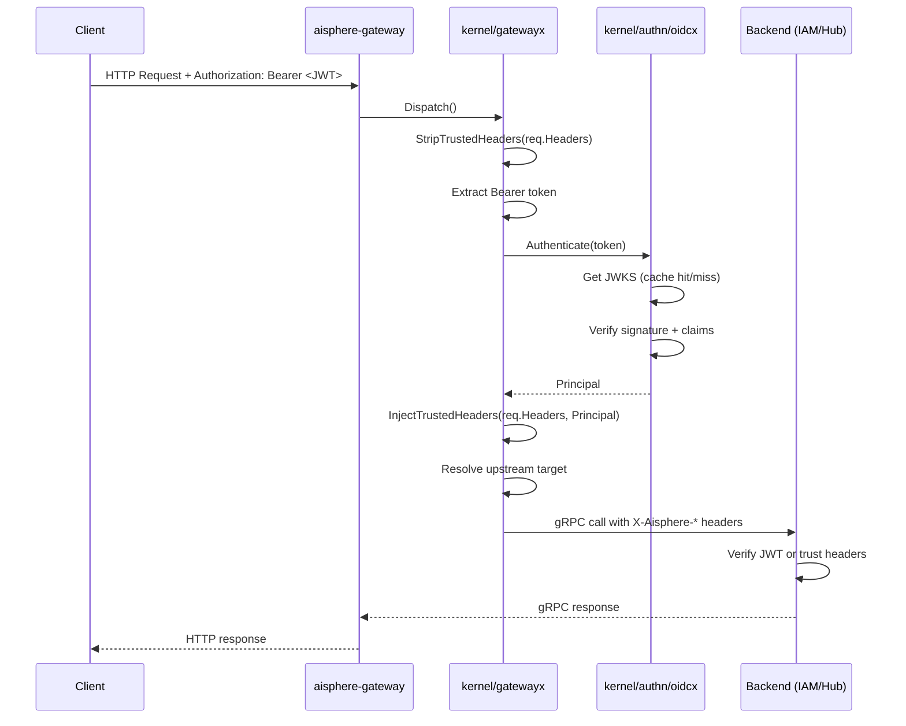

# AuthN 全流程设计参考

本文档是 Kernel layout 项目模板的 AuthN 设计参考。如果你使用本 layout 生成新服务，需要设计实现认证全流程，可以参考本文的架构、代码组织和配置方式。

## 需求目标

实现端到端认证全流程：Casdoor 签发 JWT → Gateway 本地 OIDC/JWKS 验签 → 注入可信 Principal → 转发到后端 gRPC 服务 → 后端可复用 Kernel oidcx verifier 再验证同一 JWT。

当前 authz 使用 `dev_allow_all` 短路，只测 authn 链路。

## 架构总览

```text
Casdoor 签发 JWT
  ↓
Gateway 绑定 issuer / discovery / jwks
  ↓
Gateway 自动拉取 JWKS 公钥并本地校验 JWT
  ↓
Gateway 校验 iss / aud / exp / nbf / iat / alg / owner
  ↓
Gateway 清理伪造 X-Aisphere-* header
  ↓
Gateway 注入可信 Principal
  ↓
Gateway 转发到 gRPC 后端
  ↓
后端服务可复用 Kernel oidcx verifier 再校验同一个 JWT
  ↓
authz 暂时 dev_allow_all / short-circuit，只测 authn 全链路
```

## 涉及模块

| 模块 | 责任 | 关键文件 |
| --- | --- | --- |
| `kernel/authn/oidcx` | 通用 OIDC/JWKS verifier，不依赖 Casdoor SDK | `config.go`, `jwks.go`, `verifier.go` |
| `kernel/authn/cached_authenticator.go` | token→Principal 验证结果缓存，SHA-256 key，TTL 受 token exp 限制 | `cached_authenticator.go` |
| `kernel/authn/trusted_headers.go` | Gateway 可信 header 定义、注入、剥离、重建 | `trusted_headers.go` |
| `kernel/authn/trusted_authenticator.go` | 信任 Gateway 注入的 Principal（gateway_trusted 模式） | `trusted_authenticator.go` |
| `kernel/gatewayx/dispatcher.go` | Gateway 路由分发 + authn 拦截 + header 注入 | `dispatcher.go` |
| `aisphere-gateway` | 主认证边界，本地验 JWT 后转发 | `internal/data/data.go`, `internal/conf/conf.go` |
| `aisphere-iam` | 后端服务，支持 casdoor_jwt / gateway_trusted 两种模式 | `internal/data/data.go`, `internal/conf/conf.go` |
| `aisphere-hub` | 后端服务，authn middleware 支持 Bearer + trusted headers | `internal/server/authn_middleware.go`, `internal/server/authn_grpc.go`, `internal/data/data.go` |

## Kernel authn/oidcx 包

### 目录结构

```text
kernel/authn/oidcx/
├── config.go      # 配置结构体 + Normalized() 默认值
├── jwks.go        # JWKS 发现、拉取、缓存、RSA/EC 公钥解析
└── verifier.go    # JWT 签名验证 + claims 校验 + Principal 映射
```

### 配置项

| 字段 | 类型 | 说明 | 默认值 |
| --- | --- | --- | --- |
| `provider` | string | 映射到 `Principal.Provider` | `"oidc"` |
| `issuer` | string | 期望的 JWT `iss` 值 | 从 discovery 获取 |
| `discovery_url` | string | OIDC Discovery 端点 | — |
| `jwks_url` | string | JWKS 公钥端点 | 从 discovery 获取 |
| `audience` | []string | 接受的 `aud` 值列表 | — |
| `allowed_algs` | []string | 允许的签名算法 | `[RS256, RS512, ES256, ES512]` |
| `allowed_owners` | []string | 允许的 Casdoor `owner` | — |
| `jwks_cache_ttl` | duration | JWKS 进程内缓存 TTL | 10m |
| `clock_skew` | duration | exp/nbf/iat 时钟偏差 | 60s |
| `subject_id_claim` | string | SubjectID 的 claim 名 | `"sub"` |
| `username_claim` | string | Username 的 claim 名 | `"name"` |
| `name_claim` | string | Name 的 claim 名 | `"displayName"` |
| `email_claim` | string | Email 的 claim 名 | `"email"` |
| `owner_claim` | string | Owner 的 claim 名 | `"owner"` |

### 校验内容

1. **JWT 签名** — 用 JWKS 公钥验证
2. **iss** — 必须匹配配置的 issuer
3. **aud** — 至少匹配一个配置的 audience
4. **exp** — 未过期（含 clock_skew 容差）
5. **nbf** — 已生效（含 clock_skew 容差）
6. **iat** — 不超前于当前时间（含 clock_skew 容差）
7. **alg** — 必须在 allowed_algs 中
8. **owner** — 如果在 allowed_owners 中配置了，必须匹配

### Principal 映射

```go
Principal{
    SubjectID:   sub / name,
    SubjectType: "user",
    Provider:    cfg.Provider,
    ExternalID:  owner/username,
    Issuer:      iss,
    Audience:    aud,
    OrgID:       owner,
    TenantID:    owner,
    Username:    name,
    Name:        displayName,
    Email:       email,
    Groups:      groups,
    Roles:       roles,
    Scopes:      scope,
    AuthMethod:  "oidc",
    IssuedAt:    iat,
    ExpiresAt:   exp,
}
```

## Gateway 认证流程

### 配置

```yaml
security:
  authn:
    enabled: true
    provider: casdoor
    cache_ttl_ns: 300000000000  # 5min
    oidc:
      provider: casdoor
      issuer: http://36.137.200.194:30082
      discovery_url: http://36.137.200.194:30082/.well-known/openid-configuration
      jwks_url: http://36.137.200.194:30082/.well-known/jwks
      audience: [bbdcfc272e2b990cb923]
      allowed_owners: [aisphere]
      allowed_algs: [RS256, RS512, ES256, ES512]
      jwks_cache_ttl_ns: 600000000000   # 10min
      clock_skew_ns: 60000000000        # 60s
```

### 数据流



### 关键代码路径

1. `gatewayx.Dispatcher.Dispatch()` — 入口
2. `authn.StripTrustedHeaders()` — 清理伪造 header
3. `bearer()` / `cookie()` — 提取 token
4. `d.Authenticator.Authenticate()` — oidcx 验证
5. `authn.InjectTrustedHeaders()` — 注入可信 header
6. `d.Invoker.Invoke()` — 转发到后端

## 后端服务认证模式

### 模式 1: casdoor_jwt（当前测试模式）

后端自己用 oidcx verifier 再验一次 JWT。

```yaml
security:
  authn:
    mode: casdoor_jwt
    provider: casdoor
    oidc:
      # 同 Gateway 配置
```

### 模式 2: gateway_trusted（生产推荐）

后端信任 Gateway 注入的 X-Aisphere-* header，不再验 JWT。

```yaml
security:
  authn:
    mode: gateway_trusted
```

### 模式对比

| 特性 | casdoor_jwt | gateway_trusted |
| --- | --- | --- |
| 后端验 JWT 签名 | ✅ | ❌ |
| 依赖 JWKS 可用性 | ✅ | ❌ |
| 适合网络隔离 | ❌ | ✅ |
| 需要 mTLS/NetworkPolicy | ❌ | ✅ |
| 性能（省一次验签） | 慢 | 快 |

## Hub AuthN Middleware

### HTTP Middleware

`internal/server/authn_middleware.go`:

1. 跳过 public 路径（login-url、exchange、refresh、healthz 等）
2. 从 `Authorization: Bearer <token>` 提取 credential
3. 如果没有 Bearer，尝试从 X-Aisphere-* headers 重建 Principal
4. 调用 `resources.Authn.Authenticate()` 验证
5. 注入 `authn.Principal` 到 request context

### gRPC Interceptor

`internal/server/authn_grpc.go`:

1. 跳过 public gRPC 方法（LoginURL、Exchange、Refresh 等）
2. 从 gRPC metadata 中提取 `authorization` 或 X-Aisphere-* headers
3. 调用 `resources.Authn.Authenticate()` 验证
4. 注入 `authn.Principal` 到 context

## 缓存策略

| 缓存对象 | 默认 | 说明 |
| --- | --- | --- |
| JWKS 公钥 | 进程内缓存 | 必须缓存，避免每次请求拉 JWKS |
| token → Principal | 可选 Redis / 内存 | 高 QPS 时启用 |
| raw token | 不缓存 | 避免泄露 bearer token |
| private key / client secret | 永远不缓存 | 不能进入 Redis |
| 过期 token | 不缓存 / 自动失效 | TTL 被 token exp 限制 |

### 缓存 TTL 策略

```go
effective_ttl = min(configured_cache_ttl, token_exp - now)
```

所以不会从缓存里放行过期 token。

## 配置参考

### Gateway

```yaml
security:
  authn:
    enabled: true
    provider: casdoor
    cache_ttl_ns: 300000000000
    oidc:
      provider: casdoor
      issuer: http://36.137.200.194:30082
      discovery_url: http://36.137.200.194:30082/.well-known/openid-configuration
      jwks_url: http://36.137.200.194:30082/.well-known/jwks
      audience: [bbdcfc272e2b990cb923]
      allowed_owners: [aisphere]
      allowed_algs: [RS256, RS512, ES256, ES512]
      jwks_cache_ttl_ns: 600000000000
      clock_skew_ns: 60000000000
data:
  cache:
    enabled: false  # Redis 可选，默认不开启
```

### IAM

```yaml
security:
  authn:
    enabled: true
    mode: casdoor_jwt    # 或 gateway_trusted
    provider: casdoor
    cache_ttl_ns: 300000000000
    oidc:
      # 同 Gateway 配置
  authz:
    dev_allow_all: true  # 当前只测 authn
```

### Hub

```yaml
security:
  authn:
    enabled: true
    provider: casdoor
    mode: casdoor_jwt    # 或 gateway_trusted
    cache_ttl_ns: 300000000000
    oidc:
      # 同 Gateway 配置
  authz:
    dev_allow_all: true  # 当前只测 authn
```

## 验证命令

### 编译检查

```powershell
# Kernel
cd E:\coding\aisphereio\kernel
go test ./authn/... ./gatewayx/... -v -count=1

# Gateway
cd E:\coding\aisphereio\aisphere-gateway
go build ./...
go test ./... -count=1 -short

# IAM
cd E:\coding\aisphereio\aisphere-iam
go build ./...
go test ./... -count=1 -short

# Hub
cd E:\coding\aisphereio\aisphere-hub
go build ./...
go test ./... -count=1 -short
```

### 端到端验证

```powershell
# 1. 确保 Casdoor 运行在 http://36.137.200.194:30082
# 2. 启动 Gateway
cd E:\coding\aisphereio\aisphere-gateway
go run ./cmd/aisphere-gateway --conf ./configs/config.local.yaml

# 3. 启动 IAM
cd E:\coding\aisphereio\aisphere-iam
go run ./cmd/aisphere-iam --conf ./configs/config.local.yaml

# 4. 启动 Hub
cd E:\coding\aisphereio\aisphere-hub
go run ./cmd/aisphere-hub --conf ./configs/config.local.yaml

# 5. 获取 Casdoor JWT（通过 Hub login-url + exchange 流程）
# 6. 验证 Gateway 认证
curl.exe -i http://127.0.0.1:18000/v1/iam/me `
  -H "Authorization: Bearer <access_token>"
```

## 已发现并修复的问题

### 1. Gateway data.go 与 resources.go 重复定义

**现象**：Gateway 编译失败，`ResourceOptions`、`Resources`、`NewResources` 重复定义。

**根因**：authn 改造新增 `resources.go`（oidcx 版本），但 `data.go`（旧版本）已存在相同类型。

**修复**：将 oidcx 逻辑合并到 `data.go`，删除 `resources.go`。

### 2. Hub newAuthenticator 只支持 casdoor provider

**现象**：Hub 配置 `mode: casdoor_jwt` 时，`newAuthenticator` 只返回 `casdoor.Client`，不支持 oidcx 验证。

**根因**：`newAuthenticator` 只按 `provider` 字段判断，未处理 `mode` 字段。

**修复**：重写 `newAuthenticator`，支持三种模式：
- `casdoor_jwt` / `jwt_verify` → oidcx.Verifier
- `gateway_trusted` → TrustedHeaderAuthenticator
- 默认 → casdoor.Client（兼容旧配置）

### 3. IAM models.go 与 resource_models.go 重复定义

**现象**：IAM 编译失败，所有 Model 类型重复定义。

**根因**：`models.go`（旧版，无 GORM tag）和 `resource_models.go`（新版，带 GORM tag）共存。

**修复**：删除旧版 `models.go`。

### 4. IAM repository.go 与 resource_repository.go 重复定义

**现象**：IAM 编译失败，`ControlPlaneRepository` 接口重复定义。

**根因**：`repository.go`（旧版接口）和 `resource_repository.go`（新版接口 + 实现）共存。

**修复**：删除旧版 `repository.go`。

## 后续计划

1. 等链路稳定后，把后端服务从 `casdoor_jwt` 切回 `gateway_trusted`
2. 把 authz 从 `dev_allow_all` 切回 SpiceDB
3. 高 QPS 场景开启 Redis 缓存 token 验证结果
4. 增加 oidcx 包的单元测试（当前无测试文件）
5. 增加 E2E 测试覆盖 Gateway → IAM/Hub 全链路